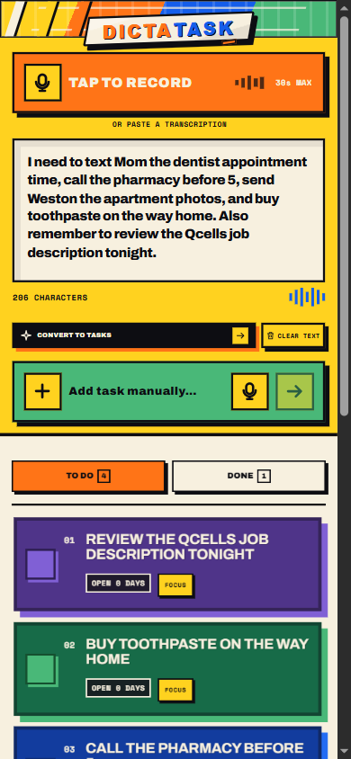
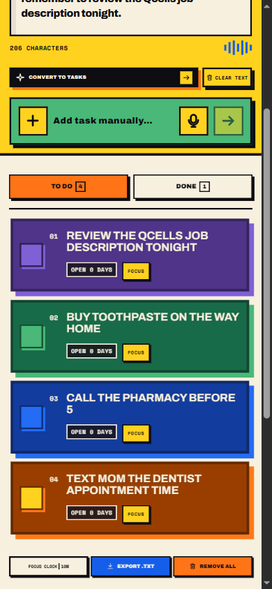
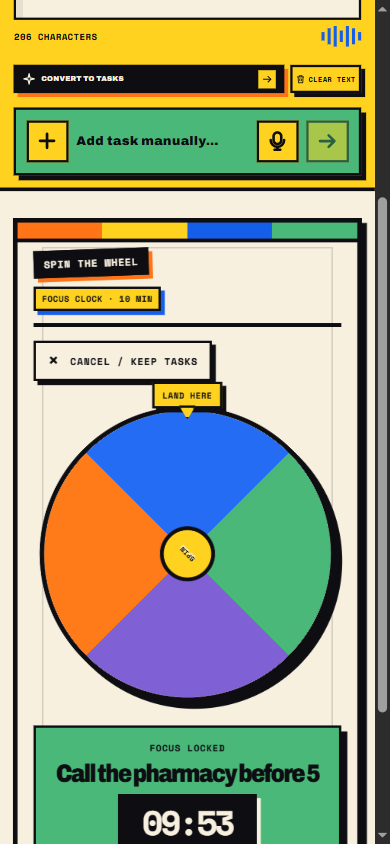
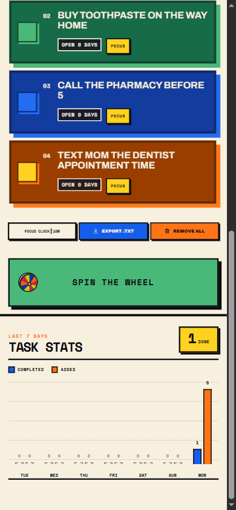

# DictaTask for Android

DictaTask is a local-first Android task board for turning a quick voice note—or a pasted transcript—into one clean list of things to do. It is built for fast, tactile use on a phone, with a bold 90s neo-brutalist visual system and no cloud account required.

The app UI is bundled into the APK. `MainActivity` serves the compiled React interface from the APK through `WebViewAssetLoader`, blocks external navigation, and stores the task board locally on the device. `INTERNET` is declared only for the user-enabled Groq transcription request; the normal app flow stays local.

## See it in action

These screenshots show the current Android-first interface at a 390px mobile viewport.

| Voice capture | Task board |
| --- | --- |
|  |  |

| Spin the Wheel | Seven-day stats |
| --- | --- |
|  |  |

## What it does

- Records a configurable 15/30/60-second native voice session or accepts a pasted transcript.
- Includes a dedicated Settings screen with five 90s-inspired themes, focus-clock defaults, task-age labels, completion celebration, and reduced-motion controls.
- Supports optional Groq Whisper transcription: enter a Groq API key in Settings, choose Whisper Large V3 Turbo or Large V3 plus the spoken language, then DictaTask records a temporary `.m4a`, sends it directly to Groq, and deletes the audio after the request. The key is encrypted with Android Keystore and never appears in exports or task storage.
- Converts transcript text into editable tasks and supports quick manual entry with dictation.
- Keeps tasks, transcripts, completion history, theme preference, and focus-clock settings on the device.
- Uses only `TO DO` and `DONE` tabs; completed history stays ordered by most recent completion.
- Lets the checkbox be the only completion control, with undo and safe recovery for accidental actions.
- Lets open tasks be focused directly, or selected through a flat, symmetric three-second Spin the Wheel animation.
- Shows how long open tasks have been waiting and provides a seven-day chart comparing tasks added with tasks completed.
- Supports left-swipe deletion for open tasks, text-history export, and a configurable 5/10/15/25-minute focus countdown.
- Keeps touch feedback straight and responsive: controls move their own shadows without tilting.
- Requests microphone access only when recording starts. It uses network access only after the user explicitly selects Groq transcription and saves a key; it does not schedule reminder notifications.

## Download

The latest internal-review APK is available from the [v1.5.33 GitHub release](https://github.com/remriel/dictatask-android-native/releases/tag/v1.5.33).

> Release builds are Android debug-signed for internal review. A Play Store release must be signed with the repository owner’s protected release key.

## Source layout

- `ui-src/` — maintainable React, TypeScript, CSS, font licenses, and production artwork.
- `app/src/main/assets/` — generated offline web bundle packaged into the APK.
- `app/src/main/java/com/remriel/dictatask/` — speech, persistence, export, and theme bridges.
- `docs/screenshots/` — current mobile UI screenshots used in this README.
- `dist/` — uniquely named internal-review APKs for each published version.

## Build locally

Prerequisites are Node.js/npm, Android SDK 36, and JDK 17 or newer. On Windows with Android Studio installed:

```powershell
$env:JAVA_HOME = "C:\Program Files\Android\Android Studio\jbr"
$env:ANDROID_HOME = "$env:LOCALAPPDATA\Android\Sdk"
$env:ANDROID_SDK_ROOT = $env:ANDROID_HOME

Push-Location ui-src
npm ci
npm run build
Pop-Location

.\gradlew.bat :app:testReleaseUnitTest :app:lintRelease :app:assembleRelease
Copy-Item app\build\outputs\apk\release\app-release.apk dist\DictaTask.apk -Force
```

The optimized APK is written to `app/build/outputs/apk/release/app-release.apk`. The release build runs offline after the web bundle is generated; no runtime network connection is needed.

## Current release

- Version: `1.5.33`
- Version code: `19`
- APK: `DictaTask-v1.5.33-groq-settings-themes.apk`
- Branch: `main`
